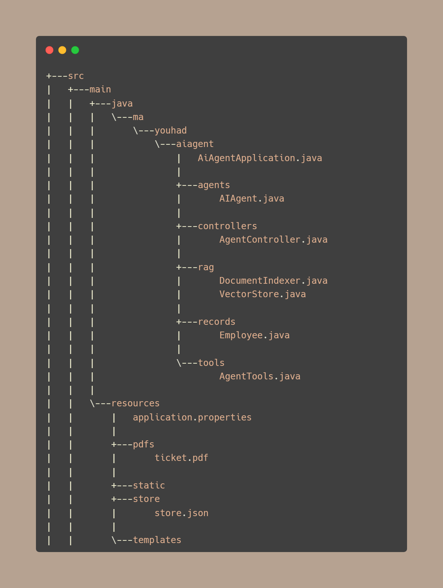
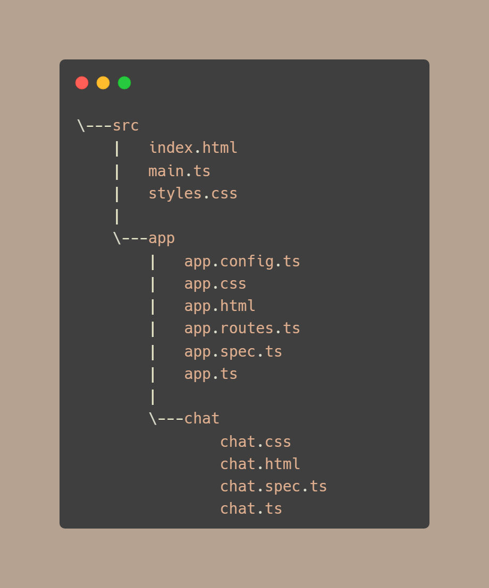

# 🤖 AI Agent Project

## ✨ Project Overview
**AI Agent** is an AI-powered question-answering system built with **Spring Boot** (backend) and **Angular 20** (frontend).  
It can:
- 💬 Answer user queries.
- 📄 Perform semantic searches on PDF documents.
- 🛠️ Provide custom tools (e.g., retrieve employee information) via a vector store.

---

## Features

### Backend
- **Spring Boot REST API**
- **AI Agent Integration** using `Spring AI ChatClient`
- **Document Indexing & Semantic Search**:
    - 📄 PDF Reader: `PagePdfDocumentReader`
    - ✂️ Text Splitter: `TokenTextSplitter`
    - 🗄️ Embeddings Storage: `SimpleVectorStore`
- **Custom Tools**:
    - 👤 Get employee information
    - 🔍 Search document context
- **Endpoints**:
    - `GET /askAgent?query=<query>` — Send a query to the AI agent
    - `POST /loadFile` — Upload a PDF for semantic search

### Frontend
- 🌐 **Angular 20** standalone components
- 💬 Simple chat interface
- ⏳ Streaming responses with progress indicator
- 📝 Markdown support for formatted responses
- ⚡ Communicates with backend using `HttpClient`

---

## 🏗️ Architecture

### Backend Structure

### Front Structure

---

## Prerequisites

- **Java 17+** / JDK compatible with Spring Boot
- **Maven**
- **Node.js 20+ / npm**
- **Angular CLI 20+**
- **OpenAI API Key**

## Usage

- Open the frontend in a browser 
- Type your query and click Send 
- AI Agent responds with streaming feedback and spinner 
- Upload PDFs via `/loadFile` endpoint to enhance answers

---

## Notes

- Maximum file upload: 30MB
- Document embeddings stored in store.json 
- Future improvements:
   - Advanced AI tools 
   - Multi-component UI 
   - Richer UI/UX design

--- 

## License

Open-source for educational and development purposes
